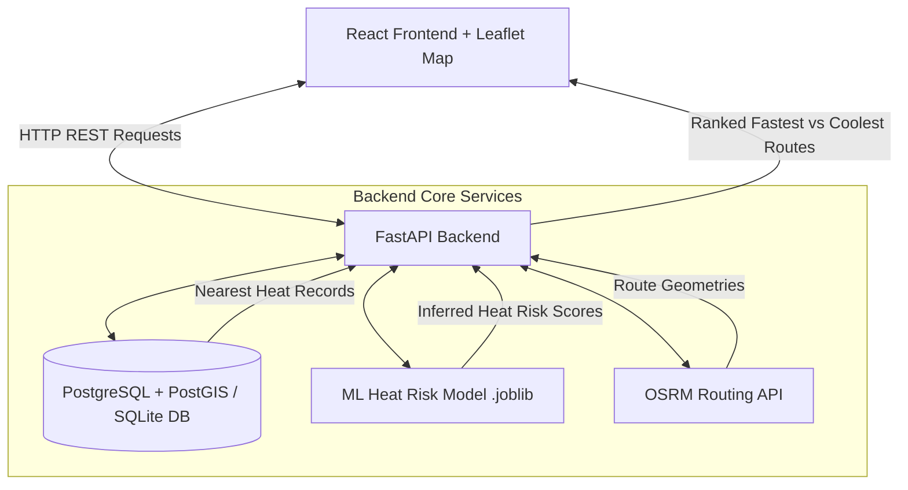

# Urban Heat Risk Prediction & Cool-Route Recommendation System

> Tagline: **Smart Routes. Cooler Future.**

---

## 1. Project Overview

Rapid urbanization and climate change have exacerbated the **Urban Heat Island (UHI)** effect. Traditional navigation applications optimize routes solely for distance and travel time. This system introduces **Heat-Aware Navigation**, predicting microclimate heat exposure along candidate routes and recommending **Cool Routes** that mitigate thermal stress for pedestrians, cyclists, and commuters.

Initially focused around **SRM University (Kattankulathur) / Chennai**, the platform combines spatial database queries, machine learning inference, and OpenStreetMap routing.

---

## 2. Problem Statement

Navigating through urban heat corridors increases risk of heat stroke, fatigue, and UV damage. Standard routing engines direct travelers through high-density urban areas with heavy asphalt paving and minimal tree canopy. 

By integrating environmental parameters (**Temperature, Humidity, UV Index, Vegetation Index (NDVI), Building Density, Shade Score**), our machine learning model computes localized Heat Risk Scores (0–100) and identifies optimal shaded paths with minimal travel time trade-offs.

---

## 3. Core Features

-  **Interactive OpenStreetMap Visualization**: Leaflet map centered on SRM Kattankulathur / Chennai with live markers, route polylines, and heat zone overlays.
-  **Cool Route Scoring Engine**: Recommends routes using a multi-objective formula:
  $$\text{Score} = 0.25 \times \text{Distance}_{\text{norm}} + 0.25 \times \text{Duration}_{\text{norm}} + 0.50 \times \text{HeatRisk}_{\text{norm}}$$
-  **Random Forest ML Heat Risk Model**: Predicts heat risk (0–100) and risk levels (`LOW`, `MODERATE`, `HIGH`, `EXTREME`).
- **PostgreSQL + PostGIS & SQLite Fallback**: Spatial database support with an automatic zero-config fallback.
-  **OSRM Integration**: Fetches real OpenStreetMap driving geometries and generates shaded alternative detour routes.

---

##  4. Technology Stack

- **Frontend**: React 18, Vite, Leaflet, React-Leaflet, Lucide-React, Axios.
- **Backend**: Python 3.13, FastAPI, Uvicorn, Pydantic v2.
- **Database**: PostgreSQL 15 + PostGIS (via Docker Compose) with automatic SQLite local fallback (`urban_heat.db`).
- **Machine Learning**: Scikit-Learn (RandomForestRegressor / XGBoost), NumPy, Pandas, Joblib.
- **Routing**: OpenStreetMap OSRM Public Routing API.

---

##  5. System Architecture Flow



---

##  6. Project Structure

```text
urban-heat-route-system/
│
├── frontend/
│   ├── src/
│   │   ├── components/
│   │   │   ├── MapView.jsx
│   │   │   ├── LocationForm.jsx
│   │   │   ├── RouteCard.jsx
│   │   │   ├── HeatLegend.jsx
│   │   │   └── Header.jsx
│   │   │
│   │   ├── services/
│   │   │   └── api.js
│   │   │
│   │   ├── App.jsx
│   │   ├── App.css
│   │   ├── index.css
│   │   └── main.jsx
│   │
│   ├── package.json
│   ├── vite.config.js
│   └── .env.example
│
├── backend/
│   ├── app/
│   │   ├── main.py
│   │   │
│   │   ├── api/
│   │   │   ├── heat.py
│   │   │   └── routes.py
│   │   │
│   │   ├── services/
│   │   │   ├── heat_service.py
│   │   │   ├── ml_service.py
│   │   │   └── route_service.py
│   │   │
│   │   ├── database/
│   │   │   ├── connection.py
│   │   │   └── models.py
│   │   │
│   │   └── schemas/
│   │       └── schemas.py
│   │
│   ├── ml/
│   │   ├── train_model.py
│   │   ├── predict.py
│   │   └── heat_risk_model.joblib
│   │
│   ├── scripts/
│   │   └── seed_heat_data.py
│   │
│   ├── requirements.txt
│   └── .env.example
│
├── docker-compose.yml
├── README.md
└── .gitignore
```

---

##  7. Installation & Running Instructions

### Step 1: Database Setup (Optional Docker Compose)
To start PostgreSQL + PostGIS container:
```bash
docker-compose up -d
```
*(Note: If Docker is not installed, the backend will automatically initialize a local SQLite spatial database database `urban_heat.db` without crashing!)*

### Step 2: Backend Setup & ML Model Training
```bash
cd backend
pip install -r requirements.txt
python scripts/seed_heat_data.py
python ml/train_model.py
```

### Step 3: Start FastAPI Backend Server
```bash
uvicorn app.main:app --host 127.0.0.1 --port 8000 --reload
```
API Documentation will be accessible at: `http://127.0.0.1:8000/docs`

### Step 4: Frontend Setup & Dev Server
```bash
cd ../frontend
npm install
npm run dev
```
Open `http://localhost:5173` in your browser.

---

##  8. API Endpoint Documentation

| Method | Endpoint | Description |
| :--- | :--- | :--- |
| `GET` | `/health` | Returns backend operational status (`{"status": "running"}`). |
| `POST` | `/api/predict-heat` | Predicts Heat Risk (0–100) & risk level from environmental metrics. |
| `GET` | `/api/heatmap` | Returns geographical heat points for interactive map overlays. |
| `POST` | `/api/recommend-route` | Compares Fastest vs. Coolest routes between start & end coordinates. |
| `POST` | `/api/route-heat` | Analyzes point-by-point heat exposure along a given geometry path. |

### Sample Route Recommendation Request (`POST /api/recommend-route`)
```json
{
  "start_lat": 12.8232,
  "start_lon": 80.0450,
  "end_lat": 12.8265,
  "end_lon": 80.0382
}
```

### Sample Response (`200 OK`)
```json
{
  "fastest_route": {
    "route_name": "Fastest Route",
    "distance_km": 1.25,
    "duration_minutes": 3.2,
    "average_heat_risk": 74.5,
    "maximum_heat_risk": 82.0,
    "heat_risk_level": "High",
    "final_score": 0.873
  },
  "coolest_route": {
    "route_name": "Coolest Route",
    "distance_km": 1.38,
    "duration_minutes": 3.8,
    "average_heat_risk": 41.2,
    "maximum_heat_risk": 52.0,
    "heat_risk_level": "Moderate",
    "final_score": 0.612
  },
  "recommended_route": "coolest_route",
  "comparison": {
    "heat_reduction_points": 33.3,
    "extra_time_minutes": 0.6,
    "summary": "Taking the Coolest Route reduces heat exposure by 33.3 points with only 0.6 min extra travel time."
  }
}
```

---

##  9. Application Screenshots

*(Placeholders for prototype visual walkthrough)*

| Interactive Map & Heatmap | Route Heat Comparison Cards |
| :---: | :---: |
| *[Map View with Risk Circles & Route Polylines]* | *[Fastest vs Coolest Route Card UI]* |

---

##  10. Future Enhancements

-  Integration with Sentinel-2 / Landsat Satellite NDVI live imagery APIs.
-  Real-time hourly sun position & building shadow calculation.
-  Mode-specific heat risk adjustments (Walking vs. Cycling vs. Driving).
