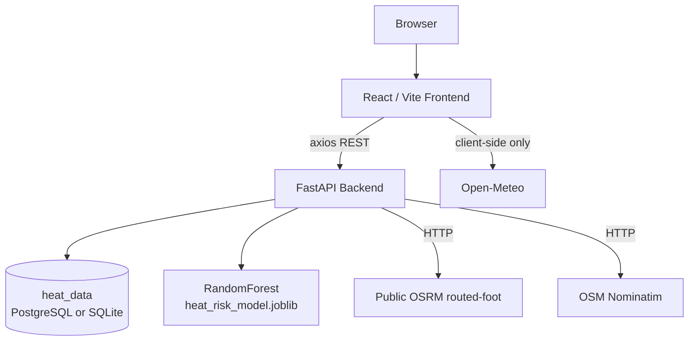

# UrbanHeat

### SRM KTR Environmental Intelligence & Heat-Aware Campus Routing Platform

> Predicts heat-exposure risk across the SRM Institute of Science and Technology, Kattankulathur (SRM KTR) campus and recommends walking routes that minimize predicted heat exposure — not just distance or time.

Full technical documentation lives in [`docs/`](docs/) and is linked throughout this README. Start there for anything beyond a quick overview.

---

## 1. What This Is

Conventional navigation apps optimize only for distance and travel time. UrbanHeat adds a third factor — **predicted heat exposure** — using a trained machine-learning model, real OSRM-derived walking routes, and a spatial heat dataset, all scoped to the SRM KTR campus boundary.

It is **not** a general city-wide router: every endpoint hard-rejects coordinates outside the SRM KTR bounding box.

## 2. Core Features

- **Interactive Leaflet heat map** (OpenStreetMap tiles) with 5 selectable layers — heat intensity, surface temperature, vegetation, built-up density, heat risk.
- **Trained ML heat-risk model** — a `RandomForestRegressor` predicting a 0–100 heat-risk score from temperature, humidity, UV index, vegetation index, building density, and shade score, with an analytical-formula fallback if the model can't load.
- **Real walking routes via OSRM** — start/end pins snapped to the actual OSM footpath graph, with alternatives filtered to those that stay fully inside campus.
- **Three-way route comparison** — Fastest / Coolest / Balanced, scored as `0.50×heat + 0.25×distance + 0.25×duration` (normalized per-request), with Coolest recommended by default.
- **Campus location search** — a curated 30-place POI list plus a backend-proxied, campus-bounded OpenStreetMap Nominatim search.
- **ML "what-if" simulator** — four sliders call the live prediction endpoint in real time.
- **Live weather widget (frontend-only)** — Open-Meteo current conditions + 24h forecast on the Home page, independent of the heat-risk pipeline.
- **Hourly diurnal heat-trend curve**, location-specific mitigation recommendations, printable heat-report modal, light/dark theme.
- **Real backend connection status** — a navbar badge reflecting a single, real `GET /health` call made once on app load (never polled).
- **No fabricated fallback data in production** — if the backend or an external service is unreachable, the UI shows an explicit "live data unavailable" state instead of substituting fake numbers.

**Not implemented** (see [docs/PROJECT_DOCUMENTATION.md §14–16](docs/PROJECT_DOCUMENTATION.md#14-limitations--honest-assessment) for the full, honest list): air quality/AQI, traffic data, safety scoring, vehicle/cycling routing, satellite/sensor-derived environmental data, authentication.

## 3. Technology Stack

| Layer | Stack |
|---|---|
| Frontend | React 18, Vite 6, Leaflet / react-leaflet / `leaflet.heat`, plain CSS design tokens, axios |
| Backend | Python 3.13, FastAPI, Pydantic v2, SQLAlchemy 2.0 |
| Database | PostgreSQL if reachable, automatic local SQLite fallback (`backend/urban_heat.db`) |
| ML | scikit-learn `RandomForestRegressor`, trained on a synthetic formula-generated dataset |
| Routing | Public OSRM `routed-foot` service (walking profile) |
| Geocoding | OpenStreetMap Nominatim, backend-proxied and campus-bounded |
| Weather | Open-Meteo (frontend-only) |

**Not used:** Mapbox, Tailwind CSS, HTTPX, PostGIS geometry types (despite `geoalchemy2`/`psycopg2` being listed dependencies), any AI/satellite imagery service. Verified directly against the source — see [docs/ARCHITECTURE.md](docs/ARCHITECTURE.md#4-technology-stack) for the full accounting.

## 4. Architecture



Full diagrams and per-file breakdown: [docs/ARCHITECTURE.md](docs/ARCHITECTURE.md).

## 5. Project Structure

```text
UrbanHeat/
├── frontend/
│   ├── src/
│   │   ├── components/     InteractiveHeatMap, MapView, RouteFinderView,
│   │   │                   LocationSearch, SimulatorView, charts, ...
│   │   ├── pages/          HomePage, HeatMapPage, RoutesPage,
│   │   │                   AnalyticsPage, InsightsPage, ...
│   │   ├── services/       api.js, heatService.js, weatherService.js
│   │   ├── utils/          riskCalculator.js
│   │   └── config/         campus.js (SRM KTR bounds + POIs)
│   ├── package.json, vite.config.js, .env.example
│
├── backend/
│   ├── app/
│   │   ├── main.py
│   │   ├── api/             heat.py, routes.py
│   │   ├── services/        heat_service.py, route_service.py,
│   │   │                    ml_service.py, campus_config.py
│   │   ├── database/        connection.py, models.py
│   │   └── schemas/         schemas.py
│   ├── ml/                  train_model.py, predict.py, heat_risk_model.joblib
│   ├── scripts/              seed_heat_data.py
│   ├── requirements.txt, .env.example
│
├── docs/                    Full technical documentation (see below)
├── docker-compose.yml       PostgreSQL/PostGIS container only (optional, local dev)
├── render.yaml              Render deployment config (start command, health check)
└── README.md
```

## 6. Setup

### Database (optional — SQLite is used automatically if skipped)

```bash
docker-compose up -d
```

### Backend

```bash
cd backend
pip install -r requirements.txt
python scripts/seed_heat_data.py
python ml/train_model.py
python -m uvicorn app.main:app --host 127.0.0.1 --port 8000 --reload
```

API docs (Swagger UI): `http://127.0.0.1:8000/docs`

### Frontend

```bash
cd frontend
npm install
npm run dev
```

Open `http://localhost:5173`.

### Environment Variables

`frontend/.env`:
```env
VITE_API_BASE_URL=http://localhost:8000
```

`backend/.env`:
```env
POSTGRES_DB=urban_heat
POSTGRES_USER=postgres
POSTGRES_PASSWORD=postgres
POSTGRES_HOST=localhost
POSTGRES_PORT=5432
CORS_ORIGINS=http://localhost:5173,http://127.0.0.1:5173
```

Never commit real credentials — both `.env` files are git-ignored; only `.env.example` (placeholder values) is committed. Full variable reference, including one documented dead/unused variable: [docs/API_DOCUMENTATION.md §Environment Variables](docs/API_DOCUMENTATION.md#environment-variables-reference).

## 7. Production Deployment

UrbanHeat's live deployment splits across two platforms:

| | |
|---|---|
| **Frontend hosting** | Vercel |
| **Frontend production URL** | https://urban-heat-virid.vercel.app/ |
| **Backend hosting** | Render |
| **Backend production URL** | https://urbanheat.onrender.com |

### 7.1 Vercel (frontend)

Set this environment variable in the Vercel project's Settings → Environment Variables:

```env
VITE_API_BASE_URL=https://urbanheat.onrender.com
```

**`VITE_*` variables are baked into the JavaScript bundle at build time, not read at runtime.** Changing this value in the Vercel dashboard has no effect on an already-built deployment — you must trigger a new deployment (Redeploy, or push a commit) for it to take effect. There is no `vercel.json` in this repo; Vercel auto-detects the Vite build (`npm run build`, output in `frontend/dist`) when the project root is set to `frontend/`.

### 7.2 Render (backend)

Set this environment variable in the Render service's Environment tab:

```env
CORS_ORIGINS=https://urban-heat-virid.vercel.app
```

Start command (already the default via [`render.yaml`](render.yaml) at the repo root, and can also be set manually in the Render dashboard):

```bash
uvicorn app.main:app --host 0.0.0.0 --port $PORT
```

`$PORT` is supplied by Render at runtime — never hardcode a port. `render.yaml` also points Render's health check at `GET /health`.

**Database note:** if no `POSTGRES_*` variables are set on Render, the backend automatically falls back to a local SQLite file (see [docs/ARCHITECTURE.md §3.2](docs/ARCHITECTURE.md#32-database-engine-selection-verified-behavior)). Render's filesystem for a web service is ephemeral — a SQLite file there will be reset on every deploy/restart. For persistent heat data in production, provision a real PostgreSQL database (e.g. Render's managed Postgres, or any reachable Postgres instance) and set the `POSTGRES_DB/USER/PASSWORD/HOST/PORT` variables accordingly.

### 7.3 Deployment order & verification checklist

1. Deploy the backend to Render first.
2. Verify it's live: open https://urbanheat.onrender.com/health and confirm `{"status":"running","service":"Urban Heat Risk Prediction API"}`.
3. Set `CORS_ORIGINS=https://urban-heat-virid.vercel.app` in Render's environment variables and redeploy the backend if it was already running.
4. Set `VITE_API_BASE_URL=https://urbanheat.onrender.com` in Vercel's environment variables.
5. **Redeploy the Vercel frontend** — required, since `VITE_*` variables are build-time only (see §7.1).
6. Open the deployed Vercel app and check the navbar's backend-status badge reads "Backend Connected".
7. Open browser DevTools → Network on the deployed app and confirm API requests go to `https://urbanheat.onrender.com/...`.
8. Confirm **no** requests go to `http://localhost:8000` — that would mean `VITE_API_BASE_URL` wasn't set at build time, or the frontend was built/deployed before the variable was added.

## 8. API Endpoints

| Method | Endpoint | Purpose |
|---|---|---|
| GET | `/health` | Health check |
| GET | `/api/location-search` | Campus-bounded place search |
| POST | `/api/predict-heat` | Raw ML prediction from 6 inputs |
| GET | `/api/heatmap` | Seeded heat data points |
| POST | `/api/location-heat-detail` | Full detail card for a coordinate |
| GET | `/api/heat-trend` | Model-driven hourly heat-risk curve |
| GET | `/api/recommendations` | Mitigation recommendations |
| POST | `/api/recommend-route` | Fastest / Coolest / Balanced route comparison |
| POST | `/api/route-heat` | Heat analysis of a custom coordinate path |

Full request/response schemas and verified live examples: [docs/API_DOCUMENTATION.md](docs/API_DOCUMENTATION.md).

## 9. Route Optimization — In Brief

Real algorithm (verified from source, **not** a generic "shortest + 20% detour" model):

```text
Snap start/end → OSRM route alternatives → keep only alternatives
whose full geometry stays inside the campus boundary → sample up to
16 points/route → score heat risk per point (ML model) → aggregate
per route → label Fastest / Coolest / Balanced → recommend Coolest
```

Balanced route score: `0.50 × (avg heat risk / 100) + 0.25 × (distance / max distance) + 0.25 × (duration / max duration)`, normalized against the candidates in that request only.

Full step-by-step derivation, the exact heat formula, and a worked example from live testing: [docs/ROUTE_OPTIMIZATION.md](docs/ROUTE_OPTIMIZATION.md).

## 10. Documentation Index

| Document | Covers |
|---|---|
| [docs/PROJECT_DOCUMENTATION.md](docs/PROJECT_DOCUMENTATION.md) | Full project report: abstract, objectives, comparison table, implemented vs. planned |
| [docs/ARCHITECTURE.md](docs/ARCHITECTURE.md) | System/frontend/backend architecture, file-by-file reference, diagrams |
| [docs/ROUTE_OPTIMIZATION.md](docs/ROUTE_OPTIMIZATION.md) | The exact routing & scoring algorithm |
| [docs/API_DOCUMENTATION.md](docs/API_DOCUMENTATION.md) | Every endpoint, request/response shapes, error cases |
| [docs/DATA_AND_ENVIRONMENTAL_ANALYSIS.md](docs/DATA_AND_ENVIRONMENTAL_ANALYSIS.md) | Data sources, the ML model, real vs. synthetic data — the most important read before presenting this project |
| [docs/VIVA_QA.md](docs/VIVA_QA.md) | 30 rehearsed viva/review questions with code-verified answers |

## 11. Known Limitations (see docs for full detail)

- Heat data is formula-generated/synthetic, not satellite- or sensor-derived.
- The committed `urban_heat.db` predates the current seed script and only sparsely covers the campus box — re-run `scripts/seed_heat_data.py` to regenerate a dense, in-bounds dataset.
- Routing depends on a public, unauthenticated OSRM server with no SLA — this project deliberately shows an explicit error state rather than a fake route when it's unavailable.
- No authentication or rate limiting on any endpoint.
- A basic pytest contract-test suite exists (`backend/tests/test_api_contract.py`), covering validation and response-shape checks for every endpoint; it does not (and should not) assert against live third-party (OSRM/Nominatim) responses.
- SQLite is not persistent on Render's ephemeral filesystem — use a real PostgreSQL instance for production data durability (see §7.2).

## 12. Future Enhancements

- Real satellite NDVI / land-surface-temperature data in place of the anchor-distance formula.
- Self-hosted OSRM instance for routing reliability.
- Air quality and safety-aware routing.
- Broader automated test coverage (integration tests against a real/managed Postgres, frontend component tests).
- Unify the backend (Python) and frontend (JS) heat-risk formulas into one source of truth.
