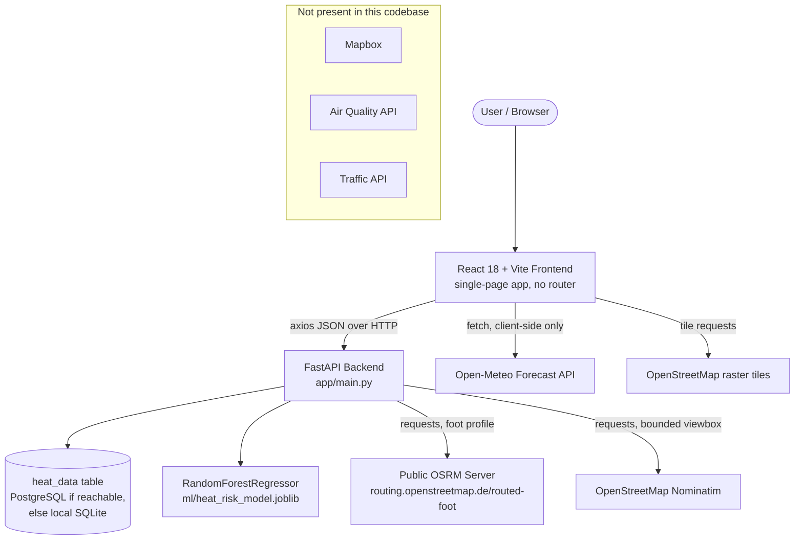
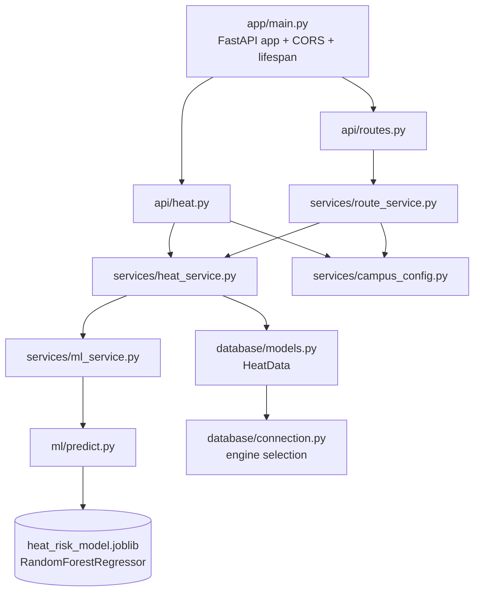
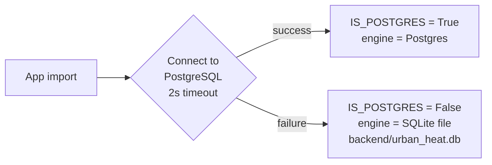
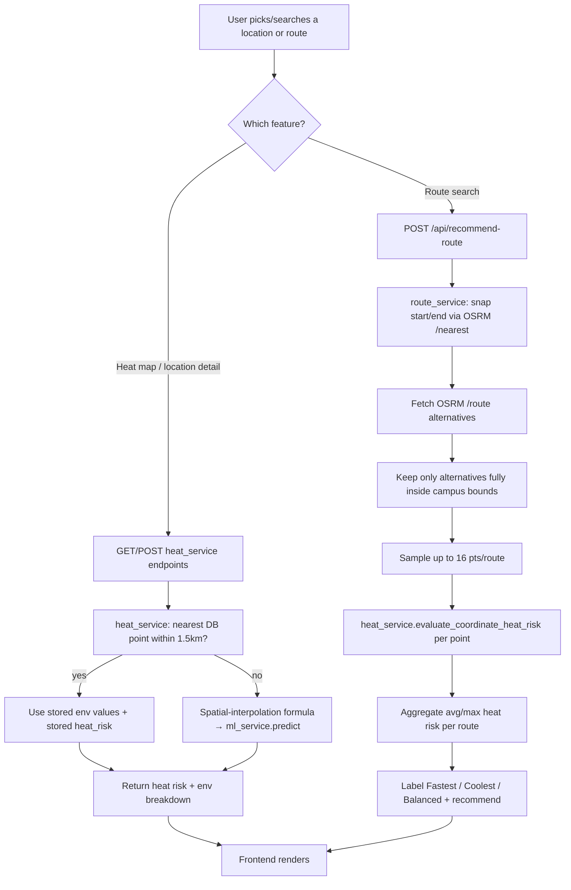

# Architecture

Companion to [PROJECT_DOCUMENTATION.md](PROJECT_DOCUMENTATION.md). All paths below are relative to the repository root and verified against the actual source.

---

## 1. System Architecture

Note the two independent external-data paths that never meet: the backend's heat-risk pipeline (DB + ML model) and the frontend's Open-Meteo widget. They report different numbers for the same location because they are different systems — this is intentional to document, not a bug to silently merge.

---

## 2. Frontend Architecture

### 2.1 Application shell

`frontend/src/App.jsx` is the entire routing layer — there is **no `react-router-dom`**. A single `activePage` string in `useState` selects which page component renders inside `<main>`. Navigation items live in `components/Navbar.jsx`:

| Nav id | Label | Renders |
|---|---|---|
| `home` | Home | `pages/HomePage.jsx` |
| `map` | Heat Map | `pages/HeatMapPage.jsx` |
| `routes` | Cool Routes | `pages/RoutesPage.jsx` |
| `analytics` / `risk` / `simulator` | Analytics & Risk | `pages/AnalyticsPage.jsx` (tabbed: `trends` / `risk` / `simulator`) |
| `insights` / `recommendations` / `learn` / `about` | Insights & Guide | `pages/InsightsPage.jsx` (tabbed: wraps `RecommendationsPage`, `LearnPage`, `AboutPage`) |

`App.jsx` also owns global state shared across pages: `currentLocation`, `heatPoints`, `theme` (persisted to `localStorage`, applied via `data-theme` attribute consumed by CSS custom properties in `App.css`).

### 2.2 File-by-file reference

| File | Purpose | Key functions / notes |
|---|---|---|
| `App.jsx` | App shell, page switching, global location/heat-point state, GPS handling | `handleSelectLocation`, `handleUseMyLocation` |
| `components/Navbar.jsx` | Top navigation, theme toggle | — |
| `components/Footer.jsx` | Footer links, also drives page navigation | — |
| `components/HeatAlertBanner.jsx` | Conditional banner when current location's risk is high | — |
| `components/LocationSearch.jsx` | Campus search box: static POI substring match + debounced backend Nominatim search | `campusLocations` (from `config/campus.js`), calls `searchCampusLocations` |
| `components/InteractiveHeatMap.jsx` | Leaflet map for the Heat Map page; renders a `leaflet.heat` canvas gradient layer, not discrete markers | `HeatGradientLayer`, `getIntensity()` (per-layer 0–1 normalization) |
| `components/MapView.jsx` | Leaflet map for the Cool Routes page; renders start/end markers + route polylines | `MapAutoRecenter`, `MapClickHandler` |
| `components/RouteFinderView.jsx` | Route search UI, route cards, turn-by-turn panel; embeds `MapView` | — |
| `components/HeatLegend.jsx` | Legend overlay matching the active heat-map layer | — |
| `components/SelectedLocationPanel.jsx` | Right-hand detail panel on Heat Map page | — |
| `components/HeatOverviewCard.jsx` | Home page summary card | — |
| `components/TemperatureChart.jsx`, `HeatTrendChart.jsx`, `HeatProfileChart.jsx`, `AreaComparison.jsx` | Analytics/route chart components (SVG/inline, no external charting library) | — |
| `components/SimulatorView.jsx` | "What-if" ML simulator: 4 sliders call `predictHeat()` live | `runSimulation()` |
| `components/ExportReportModal.jsx` | Printable heat-report modal (`window.print()` — no PDF library) | `handlePrint` |
| `components/ThemeToggle.jsx`, `DesktopHeader.jsx` | UI chrome | — |
| `pages/HomePage.jsx` | Landing page; live Open-Meteo widget via `fetchLiveWeather` | — |
| `pages/HeatMapPage.jsx` | Hosts `InteractiveHeatMap`, layer switcher, location search | `handleSelectPointFromMap` |
| `pages/RoutesPage.jsx` | Route state machine: default coords, `calculateRoutes()`, geolocation, presets | `calculateRoutes`, `handleSearch` |
| `pages/AnalyticsPage.jsx` | Tabs: Trends & Analytics / Risk Vulnerability / ML Simulator | Fetches `getHeatTrend`, `getLocationHeatDetail` |
| `pages/InsightsPage.jsx` | Tab shell wrapping `RecommendationsPage`, `LearnPage`, `AboutPage` | — |
| `pages/RecommendationsPage.jsx` | Calls `getRecommendations` for the current location | — |
| `pages/LearnPage.jsx`, `pages/AboutPage.jsx` | Static educational content | — |
| `services/api.js` | Single axios client (`VITE_API_BASE_URL`, default `http://localhost:8000`); one exported function per backend endpoint | — |
| `services/heatService.js` | Wraps `getHeatmapData`/`healthCheck`/`predictHeat` with mock-data fallback (`data/mockData.js`) | `fetchHeatPoints`, `checkBackendStatus` |
| `services/weatherService.js` | Direct Open-Meteo `fetch()` call, with local-formula fallback | `fetchLiveWeather` |
| `utils/riskCalculator.js` | Client-side NOAA-style heat-index + custom heat-risk scoring formula (independent of the backend's Python model) | `calculateHeatRisk`, `estimateMicroclimateForCoords` |
| `config/campus.js` | SRM KTR bounding box, 30-place POI list, 5 named test routes, `isWithinSrmCampus()` | — |
| `data/mockData.js` | Bundled fallback/demo content used when the backend is unreachable | — |

### 2.3 Files present but not reachable from the running app

Verified by tracing every `import` from `App.jsx` down: these files exist in `frontend/src/` but are never imported by any component that is actually rendered.

| File | Reason unreachable |
|---|---|
| `components/AboutView.jsx` | Not imported anywhere |
| `components/HeatMapView.jsx` | Only self-referenced; not imported by any page |
| `pages/RiskAssessmentPage.jsx` | Superseded by `AnalyticsPage.jsx`'s inline "Risk Vulnerability" tab |
| `pages/SimulatorPage.jsx` | Superseded by `AnalyticsPage.jsx`'s inline "ML Simulator" tab (which uses `SimulatorView` directly) |

These are documented for completeness/traceability, not deleted or treated as active functionality.

---

## 3. Backend Architecture

### 3.1 Service responsibilities

| File | Responsibility |
|---|---|
| `app/main.py` | Creates the FastAPI app, configures CORS from `CORS_ORIGINS`, runs `init_db()` and `ml_service.load_model()` on startup via a `lifespan` context manager, defines `/health` |
| `app/api/heat.py` | `/api/location-search`, `/api/predict-heat`, `/api/heatmap`, `/api/location-heat-detail`, `/api/heat-trend`, `/api/recommendations` |
| `app/api/routes.py` | `/api/recommend-route`, `/api/route-heat` |
| `app/services/heat_service.py` | DB-backed nearest-point lookup (spatial bounding-box + haversine), spatial-interpolation fallback for un-seeded coordinates, hourly diurnal trend generation, rule-based recommendation ranking |
| `app/services/route_service.py` | OSRM integration (snap, fetch alternatives), polyline decoding, campus-boundary filtering, per-route point sampling + heat aggregation, three-way route scoring, in-process 5-minute result cache |
| `app/services/ml_service.py` | Thin class wrapper that loads the model once and forwards `predict()` calls to `ml/predict.py` |
| `app/services/campus_config.py` | The single source of truth for the SRM KTR bounding box and the `is_within_srm_campus()` / `route_geometry_is_within_srm_campus()` guards used by nearly every endpoint |
| `app/schemas/schemas.py` | All Pydantic request/response models — see [API_DOCUMENTATION.md](API_DOCUMENTATION.md) |
| `app/database/models.py` | `HeatData` — the **only** database table in the project |
| `app/database/connection.py` | Tries a 2-second PostgreSQL connection using `POSTGRES_*` env vars; on any failure, transparently falls back to a local SQLite file at `backend/urban_heat.db` |
| `ml/train_model.py` | Generates a 4,000-row **synthetic** dataset from a hand-written formula, trains `RandomForestRegressor` (or `XGBRegressor` if `USE_XGBOOST=true`), saves the model |
| `ml/predict.py` | Loads the saved model once (cached module-level singleton), runs inference, and contains an **identical analytical formula** as a fallback if the model file is missing or inference throws |
| `scripts/seed_heat_data.py` | Populates the `heat_data` table with a 16×16 synthetic grid across the campus bounding box, using the same style of formula as `ml/predict.py`'s fallback |

### 3.2 Database engine selection (verified behavior)

This happens at **import time** of `app/database/connection.py`, before any request is served — not per-request. In the default local setup (no Postgres running), the app silently and correctly uses SQLite; this is by design, not an error state.

---

## 4. Data Flow (End-to-End)

---

## 5. Security Architecture

| Concern | Status |
|---|---|
| Environment variables for secrets | `.env` files (git-ignored) hold DB creds; `.env.example` documents required keys with placeholder values |
| Hardcoded credentials | None found in source |
| CORS | Configured via `CORS_ORIGINS` env var, defaults restricted to local dev ports |
| Input validation | Pydantic models with field constraints (`ge`/`le` ranges) on every request body/query |
| Authentication / authorization | Not implemented — every endpoint is public |
| Rate limiting | Not implemented |
| API timeouts on outbound calls | All `requests` calls to OSRM/Nominatim use explicit timeouts (8–12s) with limited retries |
| Secrets in frontend bundle | N/A — no API keys are required client-side (Open-Meteo and OSM tiles are keyless public services) |
| SQL injection | Mitigated — all DB access goes through SQLAlchemy's query builder, no raw string SQL |

---

*See also: [ROUTE_OPTIMIZATION.md](ROUTE_OPTIMIZATION.md) for the routing algorithm in full detail, [API_DOCUMENTATION.md](API_DOCUMENTATION.md) for endpoint contracts.*
