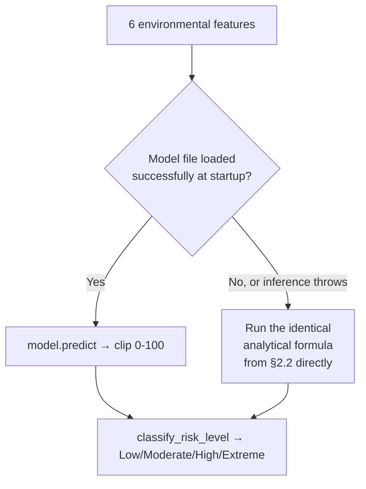
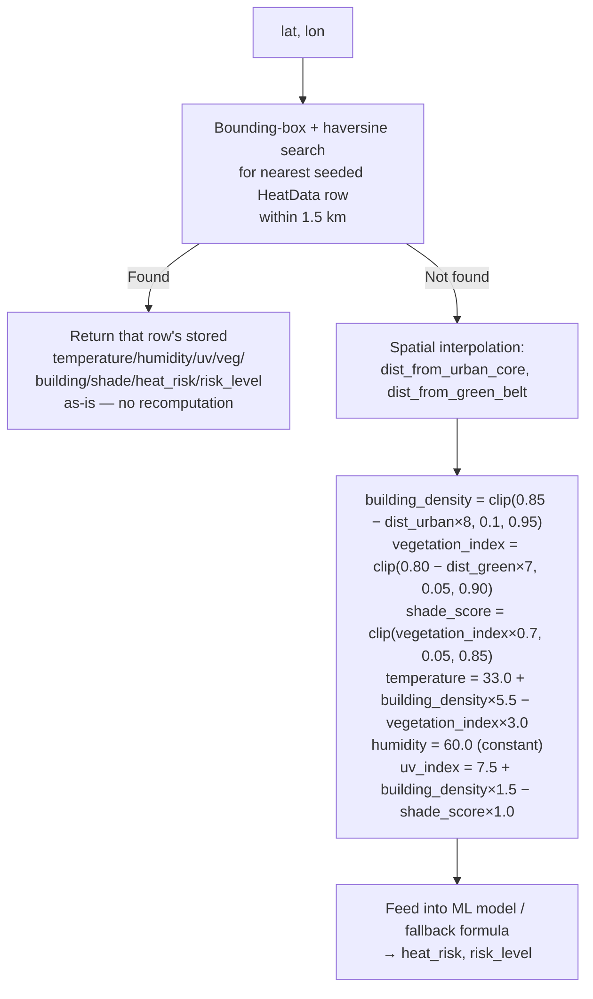

# Data Sources & Environmental Analysis

This document explains exactly where every number in UrbanHeat comes from, and is explicit about what is **real external data**, what is a **trained model's prediction**, what is a **deterministic formula standing in for real data**, and what is **static reference/demo content**. This distinction is the single most important thing to understand about this project before a viva or technical review.

---

## 1. Data Source Classification

### 1.1 Real, live, external API data

| Data | Source | Where used |
|---|---|---|
| Current temperature, apparent temperature, humidity, wind speed, precipitation, weather code, surface pressure | **Open-Meteo** `/v1/forecast` (`current=` params) | `frontend/src/services/weatherService.js`, Home page widget only |
| Hourly temperature/humidity/apparent-temperature/UV-index forecast (next 24h) | **Open-Meteo** `/v1/forecast` (`hourly=` params) | Same, Home page 24h forecast strip |
| Place-name search results within campus viewbox | **OpenStreetMap Nominatim** | `GET /api/location-search`, backend-proxied |
| Base map imagery | **OpenStreetMap raster tiles** | Both Leaflet map components |
| Real walkable street/path geometry, turn-by-turn steps, distance, duration | **OSRM** (`routing.openstreetmap.de/routed-foot`) | `POST /api/recommend-route` |

### 1.2 Model-predicted data

| Data | Model | Where used |
|---|---|---|
| `heat_risk` score (0–100) for a coordinate not in the seeded database | `RandomForestRegressor` (`ml/heat_risk_model.joblib`), trained on synthetic data — see §2 | `heat_service.evaluate_coordinate_heat_risk` → nearly every heat endpoint |
| `predicted_heat_risk` from arbitrary manual inputs | Same model | `POST /api/predict-heat`, ML Simulator UI |

### 1.3 Deterministic-formula "synthetic sensor" data

This is the most important category to understand honestly: **most of what the UI presents as "environmental readings" (temperature, humidity, UV index, vegetation index, building density, shade score) at a given campus coordinate is not measured — it is generated by a fixed mathematical formula based on distance from two hardcoded reference points.** There is no satellite feed, no IoT sensor, no NDVI imagery anywhere in this codebase.

| Data | Generation method | File |
|---|---|---|
| The 256-point seeded campus heat grid | Distance-based formula from two anchor points + random jitter (seeded, deterministic) | `backend/scripts/seed_heat_data.py` |
| Heat risk for any coordinate >1.5km from a seeded point | Same style of formula, computed live | `backend/app/services/heat_service.py::evaluate_coordinate_heat_risk` |
| Client-side microclimate estimate (GPS points, simulator fallback) | An independent, differently-tuned JS formula using the same distance-from-anchor idea | `frontend/src/utils/riskCalculator.js::estimateMicroclimateForCoords` |

### 1.4 Static / project reference data

| Data | Source |
|---|---|
| SRM KTR campus bounding box | Hand-drawn, `campus_config.py` / `config/campus.js` |
| 30 named campus POIs + coordinates | Hand-entered, `config/campus.js` |
| 5 named test routes (e.g. "SRM Main Gate to Tech Park") | Hand-entered, `config/campus.js` |
| "Vulnerable groups" advisory text, "insights" cards on Analytics page | Static hardcoded copy, `pages/AnalyticsPage.jsx` |
| Mock/demo data (`MOCK_LOCATIONS`, `MOCK_HEAT_POINTS`, `MOCK_TREND_DATA`, `MOCK_RECOMMENDATIONS`) | `frontend/src/data/mockData.js` — used as an offline/demo fallback when the backend is unreachable |

---

## 2. The Heat Risk Model

### 2.1 Training data — synthetic, not observed

`backend/ml/train_model.py::generate_synthetic_data()` generates **4,000 synthetic rows**, each with uniformly random values for six features, and a target `heat_risk` computed by an explicit formula (below) plus Gaussian noise (σ=2.5). This is **not** historical weather station data, satellite data, or campus measurement — it is a deliberately hand-designed formula turned into training examples so a real ML model (rather than the formula itself) can be shipped and demonstrated.

| Feature | Sampled range |
|---|---|
| `temperature` (°C) | 26.0 – 44.0 |
| `humidity` (%) | 35.0 – 85.0 |
| `uv_index` | 2.0 – 11.0 |
| `vegetation_index` (NDVI-style, 0–1) | 0.05 – 0.95 |
| `building_density` (0–1) | 0.10 – 0.95 |
| `shade_score` (0–1) | 0.05 – 0.90 |

### 2.2 The ground-truth formula (used both to generate training labels and as the runtime fallback)

Identical formula appears in three places: `ml/train_model.py::compute_heat_risk`, `ml/predict.py`'s analytical fallback, and (independently re-implemented, not shared code) `scripts/seed_heat_data.py::calculate_seed_heat_risk`.

```text
temp_factor   = clip((temperature − 25.0) / 20.0, 0, 1) × 35.0
hum_factor    = clip((humidity   − 30.0) / 60.0, 0, 1) × 15.0
uv_factor     = clip(uv_index / 12.0, 0, 1) × 20.0
bld_factor    = clip(building_density, 0, 1) × 30.0
veg_factor    = clip(vegetation_index, 0, 1) × 25.0
shade_factor  = clip(shade_score, 0, 1) × 25.0

heat_risk = clip(20.0 + temp_factor + hum_factor + uv_factor + bld_factor
                       − veg_factor − shade_factor,
                  0.0, 100.0)
```

In words: a base offset of 20, plus up to +35 for heat, +15 for humidity, +20 for UV, +30 for building density, **minus** up to −25 for vegetation cover and −25 for shade — clipped to the 0–100 range. Risk level buckets: `≤25` Low, `≤50` Moderate, `≤75` High, `>75` Extreme.

### 2.3 Model training

```text
Algorithm:  RandomForestRegressor(n_estimators=100, max_depth=12, random_state=42)
            (XGBRegressor is used instead only if USE_XGBOOST=true is set
             at training time — the model file currently shipped in this
             repository was verified to be a RandomForestRegressor)
Split:      80% train / 20% test (random_state=42)
Metrics:    Mean Absolute Error (MAE), Root Mean Squared Error (RMSE) — printed
            to console at training time, not persisted anywhere
Output:     backend/ml/heat_risk_model.joblib
```

### 2.4 Inference & fallback



This means the system **never fails to return a heat-risk number** — worst case, it silently degrades from "ML-model prediction" to "the same formula the model was trained to approximate," which in practice tracks closely since the model was trained on that exact formula plus noise.

### 2.5 Route-level heat aggregation

See [ROUTE_OPTIMIZATION.md §2.7](ROUTE_OPTIMIZATION.md#27-per-route-aggregation) for how per-point scores become a route-level `average_heat_risk`/`maximum_heat_risk`. There is no separate "air quality" or "safety" aggregation anywhere — those metrics do not exist in this project.

---

## 3. How a Single Coordinate's "Environment" Is Actually Determined

`heat_service.evaluate_coordinate_heat_risk(db, lat, lon)`:



Anchors used: **"urban core"** ≈ `(12.823, 80.045)` — the dense academic/tech-park area — and **"green belt"** ≈ `(12.815, 80.030)` in this fallback function (note: the seed script uses a slightly different green-belt anchor, `(12.8255, 80.0470)`, near the sports complex — the two formulas were tuned independently and are not identical, which is a known internal inconsistency documented rather than hidden).

`humidity` in the fallback path is a **hardcoded constant (60.0)** — it does not vary spatially in the fallback formula, only in the seeded-database path (where it was set with random variation at seed time) and in the Open-Meteo-driven Home page widget (which is a completely separate code path).

---

## 4. The Seeded Campus Grid

`backend/scripts/seed_heat_data.py` generates a **16×16 = 256-point grid** spanning the campus bounding box (`12.8188–12.8280`, `80.0372–80.0516`), with each point:

1. Jittered slightly (±0.0002° lat, ±0.0003° lon) so points aren't perfectly regular.
2. Assigned `building_density` and `vegetation_index` by distance from the urban-core/green-belt anchors (formula in §2.2's sibling implementation — see file for exact constants; broadly the same shape as §3's fallback, rescaled for the smaller campus-only grid).
3. `temperature`, `humidity`, `uv_index` derived from those two plus small random noise.
4. `heat_risk` computed via the §2.2 formula (not the ML model — the seed script calls its own local `calculate_seed_heat_risk`, functionally identical to the formula but a separate, independently-maintained copy).

**Known data-freshness issue (verified by direct inspection):** the `backend/urban_heat.db` file currently committed to this workspace does **not** match what the current version of this script would produce. Querying the live database directly shows 256 total rows spanning roughly `12.779–12.871°` latitude and `79.999–80.091°` longitude — a much wider area than the current campus box — of which only a handful actually fall inside the `12.8188–12.8280` / `80.0372–80.0516` box the app queries against. This indicates the committed database predates a fix (documented in the seed script's own comments) that narrowed the grid to the real campus area. Running `python scripts/seed_heat_data.py` would regenerate a dataset matching current code intent (256/256 points inside campus bounds). This is flagged as a data-freshness limitation, not silently worked around.

---

## 5. Real-Time vs. Calculated vs. Static — Summary Table

| Category | Examples | Refreshes when? |
|---|---|---|
| **Real-time external API** | Open-Meteo current weather (Home page only); OSRM route geometry/duration; Nominatim search results | Every request (no caching on the Open-Meteo/Nominatim path; OSRM route results cached 5 min in-process) |
| **Calculated (model/formula)** | `heat_risk` score, `risk_level`, diurnal trend curve, route heat aggregates, recommendation ranking | Every request — always computed live from current inputs, never pre-stored per-request |
| **Static/seeded project data** | The 256-point heat grid's environmental values, campus POI coordinates, campus bounding box, named test routes | Only when `seed_heat_data.py` is re-run, or the source file is edited |

## 6. Missing-Data Handling

- **No seeded point within 1.5 km:** falls back to the spatial-interpolation formula (§3) — never returns an error or a null heat score.
- **OSRM unreachable:** `fetch_osrm_routes` retries 3× with backoff, then returns an empty list, which surfaces as a `503` from `/api/recommend-route`.
- **Nominatim unreachable:** `/api/location-search` returns `503` directly.
- **Open-Meteo unreachable (frontend):** `weatherService.js` catches the failure and returns a clearly-labeled `{isLive: false, source: 'Calibrated Microclimate Engine', ...}` object computed from `estimateMicroclimateForCoords` instead — the UI is expected to be able to distinguish live vs. fallback via the `isLive`/`source` fields (verify against the actual component consuming it for whether this label is surfaced to the user).
- **ML model file missing/corrupt:** silent fallback to the analytical formula (§2.4) — logged as a warning server-side, invisible to the API consumer.

## 7. Air Quality, Traffic, Safety — Explicitly Not Implemented

None of `AQI`, `PM2.5`, `PM10`, traffic congestion/speed data, or a safety/crime dataset exist anywhere in this codebase — no fields, no API calls, no formulas. Any prior assumption that UrbanHeat scores routes on air quality or safety is incorrect for this implementation and is corrected here explicitly, per the requirement not to present unimplemented features as real.

---

## 8. Full SRM KTR Campus POI List

(As currently defined in `frontend/src/config/campus.js` — 30 entries.)

| Location | Latitude | Longitude | Category |
|---|---:|---:|---|
| SRM Main Campus | 12.8233 | 80.0435 | Overall campus |
| Main Block | 12.8240 | 80.0427 | Main academic area |
| University Building / Administrative Building | 12.82331 | 80.04245 | Administration and library |
| SRM Central Library | 12.8235 | 80.0426 | University Building area |
| Tech Park | 12.8234 | 80.0446 | Tech Park and food court |
| Raman Research Park | 12.8230 | 80.0448 | Research area |
| CRC Block | 12.8245 | 80.0430 | Classroom complex |
| Hi-Tech Block | 12.8250 | 80.0430 | Engineering |
| ES Block | 12.8255 | 80.0425 | EEE and Electronics |
| Mechanical A-E | 12.8260 | 80.0415 | Mechanical Engineering |
| Automobile Block | 12.8265 | 80.0408 | Automobile Engineering |
| Mechanical Hanger | 12.8270 | 80.0405 | Mechanical labs |
| Aerospace Hanger | 12.8272 | 80.0400 | Aerospace |
| Structural Testing Lab | 12.8265 | 80.0398 | Civil and structural |
| Basic Engineering Lab (BEL) | 12.8235 | 80.0415 | Engineering labs |
| MBA Block | 12.8230 | 80.0410 | Management |
| Biotechnology Block | 12.8225 | 80.0405 | Biotechnology |
| Kalam Block | 12.8240 | 80.0415 | Academic |
| PG Block | 12.8245 | 80.0420 | Postgraduate |
| Old Library / Civil Block | 12.8245 | 80.0415 | Civil Engineering |
| Dr. T.P. Ganesan Auditorium | 12.8240 | 80.0460 | Major auditorium |
| Sports Complex | 12.8250 | 80.0470 | Sports area |
| Cricket Ground | 12.8260 | 80.0470 | Sports |
| Football Ground | 12.8270 | 80.0470 | Sports |
| Indoor Game Studio | 12.8250 | 80.0460 | Indoor sports |
| Fab Lab | 12.8240 | 80.0460 | Innovation |
| SRM Medical College Hospital | 12.8190 | 80.0500 | Medical campus |
| M Block Girls Hostel | 12.8195 | 80.0470 | Hostel area |
| Meenakshi Hostel | 12.8220 | 80.0430 | Girls hostel |
| Food Court - Tech Park | 12.823418 | 80.044586 | Food court |
| Inspiration Studio Hall | 12.823573 | 80.043505 | DEI |

These are **hand-entered reference coordinates for named places**, approximate to the location they label — not surveyed building footprints, not officially published SRM campus GIS data, and not independently verified against satellite imagery as part of this project.
