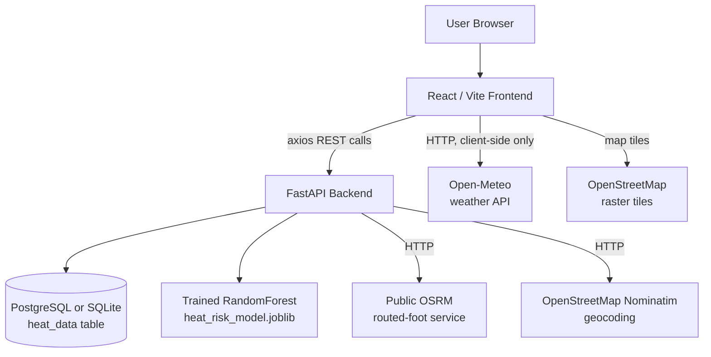

# UrbanHeat

## SRM KTR Environmental Intelligence & Heat-Aware Campus Routing Platform

| | |
|---|---|
| **Project Name** | UrbanHeat |
| **Project Type** | Full-stack web application (React SPA + FastAPI REST backend) |
| **Primary Deployment Area** | SRM Institute of Science and Technology, Kattankulathur (SRM KTR) campus, Tamil Nadu, India |
| **Frontend Stack** | React 18, Vite 6, plain CSS design-token system, Leaflet / react-leaflet |
| **Backend Stack** | Python 3.13, FastAPI, Pydantic v2, SQLAlchemy 2.0 |
| **Machine Learning** | scikit-learn `RandomForestRegressor` trained on a synthetic, formula-generated dataset |
| **Database** | PostgreSQL if reachable, otherwise an automatic local SQLite fallback (`backend/urban_heat.db`) |
| **Mapping** | Leaflet + OpenStreetMap raster tiles (**not** Mapbox — see [§4](#4-technology-stack)) |
| **Routing Engine** | Public OSRM foot-routing server (`routing.openstreetmap.de/routed-foot`) |
| **Live Weather API** | Open-Meteo (frontend-only, Home page widget) |
| **Geocoding** | OpenStreetMap Nominatim, proxied through the backend and bounded to campus |

> UrbanHeat is a real-time environmental intelligence and heat-aware pedestrian routing platform focused exclusively on the SRM Institute of Science and Technology, Kattankulathur (SRM KTR) campus. It visualizes spatial heat risk across campus, predicts heat exposure at any point using a trained machine-learning model, and recommends walking routes between campus locations that minimize predicted heat exposure instead of only distance or time.

This document is the primary reference. It is cross-linked with:

- [ARCHITECTURE.md](ARCHITECTURE.md) — system, frontend, backend and data architecture, with diagrams
- [ROUTE_OPTIMIZATION.md](ROUTE_OPTIMIZATION.md) — the exact route generation and scoring algorithm
- [API_DOCUMENTATION.md](API_DOCUMENTATION.md) — every backend endpoint, request/response shape, and error case
- [DATA_AND_ENVIRONMENTAL_ANALYSIS.md](DATA_AND_ENVIRONMENTAL_ANALYSIS.md) — data sources, the heat model, and what is real vs. simulated
- [VIVA_QA.md](VIVA_QA.md) — rehearsed Q&A for project review / viva

All content below was produced by reading the actual source in `frontend/` and `backend/`, not from assumptions. Wherever a common feature (traffic, safety scoring, air quality, satellite data, Mapbox) is **not** present in the code, this is stated explicitly rather than implied.

---

## 1. Introduction

### 1.1 Background

Urban heat is not uniform. Two points a few hundred metres apart on a campus can differ meaningfully in perceived temperature depending on building density, pavement material, tree canopy, and shade — a phenomenon generally referred to as the Urban Heat Island (UHI) effect. For pedestrians, cyclists, and anyone walking between buildings in a hot climate (such as Chennai, Tamil Nadu), the difference between a shaded, vegetated path and an open concrete corridor can be significant in terms of thermal comfort and heat-stress risk.

### 1.2 Problem

Conventional navigation tools (Google Maps, Apple Maps, and most OSM-based routers) optimize purely for **distance** and/or **travel time**. They have no concept of environmental exposure. The shortest or fastest path between two points on a campus is frequently the path that crosses the most exposed, built-up, shade-free ground — which is precisely the path a heat-conscious pedestrian would want to avoid during peak afternoon hours.

### 1.3 Motivation

SRM KTR is a large, walkable campus where students, faculty, and staff routinely travel on foot between academic blocks, hostels, the library, sports facilities, and food courts, often during the hottest hours of the day. There is no existing campus-specific tool that surfaces heat risk spatially or factors it into route choice.

### 1.4 Proposed Solution

UrbanHeat combines:

1. A spatial heat-risk dataset and a trained ML model that scores any coordinate on campus for heat exposure (0–100).
2. Live OSRM-based walking-route alternatives between two campus points.
3. A route-scoring step that samples each candidate route and picks the option with the best combination of low heat exposure and reasonable distance/duration.
4. An interactive Leaflet heat-map, analytics dashboards, a "what-if" ML risk simulator, and campus-specific location search — all scoped to the SRM KTR campus boundary.

### 1.5 Target Users

| Role | Relevance |
|---|---|
| SRM students | Daily inter-block walking, checking heat risk before outdoor activity |
| SRM faculty & staff | Campus commuting, planning outdoor sessions/events |
| Campus visitors | Unfamiliar with campus layout, benefit from heat-aware routing |
| Pedestrians | The only travel mode this project actually implements (see [§1.6](#16-scope-note)) |

`Drivers` and `Cyclists` are **not** included — the routing engine is hard-configured to OSRM's `routed-foot` (walking) profile only (`backend/app/services/route_service.py:13`). There is no vehicle or bicycle routing profile anywhere in the code.

### 1.6 Scope Note

Every backend endpoint that accepts coordinates rejects points outside the SRM KTR bounding box with an HTTP 400 error. This is a deliberate, hard-coded restriction (`app/services/campus_config.py`), not a soft default — UrbanHeat is a **campus-scoped** system, not a general city-wide router.

---

## 2. Abstract

UrbanHeat is a full-stack environmental-intelligence platform scoped to the SRM Institute of Science and Technology, Kattankulathur campus. Conventional pedestrian navigation optimizes distance and time only; UrbanHeat additionally incorporates predicted heat exposure into route selection. The backend, built with FastAPI, exposes a spatial heat dataset (a synthetically generated but geographically structured grid covering campus, stored via SQLAlchemy in PostgreSQL or a local SQLite fallback) and a `scikit-learn RandomForestRegressor` model trained to predict a 0–100 heat-risk score from six environmental features (temperature, humidity, UV index, vegetation index, building density, shade score). For routing, the backend calls the public OSRM foot-routing service to obtain real walkable-path alternatives between two campus points snapped to the OSM street/path graph, discards any alternative whose geometry leaves the campus boundary, samples each remaining candidate at up to 16 points along its length, evaluates predicted heat risk at each sampled point via the trained model, and returns three labeled routes — Fastest, Coolest, and Balanced — with the Coolest route recommended by default. The React/Vite frontend renders this data on a Leaflet map with a canvas heat-gradient overlay, exposes campus-specific location search (a curated static POI list plus a Nominatim-backed search bounded to campus), an interactive ML "what-if" simulator, and analytics/insight dashboards. A client-side Open-Meteo integration additionally provides a live current-weather widget on the home page, independent of the backend's heat-risk pipeline. The result is a working demonstration of climate-aware routing on a single, well-understood campus, built entirely on free/public services (OpenStreetMap tiles, OSRM, Nominatim, Open-Meteo) with no paid API dependency such as Mapbox.

---

## 3. Project Objectives

1. Provide a spatial visualization of predicted heat risk across the SRM KTR campus.
2. Predict heat-risk score (0–100) for any coordinate on campus using a trained ML model.
3. Provide campus-specific location search (curated POIs + bounded OSM geocoding).
4. Generate real, walkable OSRM route alternatives between two campus points.
5. Analyze environmental conditions (heat) at sampled points along each candidate route.
6. Score and rank route alternatives to recommend the lowest-heat-exposure practical route.
7. Surface an hourly heat-risk trend and location-specific mitigation recommendations.
8. Provide an interactive simulator to explore how each environmental factor changes predicted risk.
9. Restrict all functionality to the verified SRM KTR campus boundary for data integrity.

Objectives **not** pursued in the current implementation (see [§9](#9-existing-system-vs-proposed-system) and [§14 Limitations](#14-limitations--honest-assessment)): air-quality-based routing, traffic-aware routing, and route safety scoring.

---

## 4. Technology Stack

| Technology | Actual Role in This Project | Status |
|---|---|---|
| React 18 | Frontend UI, single-page app (no router — internal tab state in `App.jsx`) | Implemented |
| Vite 6 | Frontend dev server & production build | Implemented |
| Plain CSS (`App.css`, `index.css`) | Design tokens (CSS custom properties) + component styling | Implemented |
| **Tailwind CSS** | — | Not used (no dependency in `package.json`) |
| Leaflet / react-leaflet / `leaflet.heat` | Interactive map, heat-gradient canvas overlay, route polylines | Implemented |
| **Mapbox GL JS** | — | **Not used anywhere in this codebase** |
| lucide-react | Icon set | Implemented |
| axios | Frontend → backend HTTP client (`services/api.js`) | Implemented |
| Python 3.13 / FastAPI | REST backend, all `/api/*` and `/health` endpoints | Implemented |
| Pydantic v2 | Request/response schema validation (`app/schemas/schemas.py`) | Implemented |
| `requests` (sync HTTP) | Backend → OSRM and Nominatim calls | Implemented (not HTTPX) |
| SQLAlchemy 2.0 | ORM for the single `heat_data` table | Implemented |
| PostgreSQL | Attempted first at startup (2s timeout); used if reachable | Partial — Configured, optional |
| SQLite | Automatic fallback database (`backend/urban_heat.db`) | Implemented, default in practice |
| `geoalchemy2`, `psycopg2-binary` | Listed as dependencies for PostGIS support | Partial — **Installed but unused** — the `HeatData` model uses plain `Float` lat/lon columns, no `Geometry` column type anywhere in code |
| scikit-learn | `RandomForestRegressor` heat-risk model | Implemented, currently the model actually shipped |
| XGBoost | Alternative trainable model, selected via `USE_XGBOOST=true` env var at training time only | Partial — Available but not the model currently trained/shipped |
| joblib | Model serialization (`ml/heat_risk_model.joblib`) | Implemented |
| OSRM (`routing.openstreetmap.de/routed-foot`) | Real walking-route alternatives, nearest-point snapping | Implemented |
| **Mapbox Directions API** | — | Not used |
| OpenStreetMap Nominatim | Campus place-name search (backend-proxied, bounded) | Implemented |
| Open-Meteo | Live current weather + 24h forecast widget | Implemented, **frontend-only**, not used in backend route/heat scoring |
| python-dotenv | Loads `.env` for both frontend (`import.meta.env`) and backend | Implemented |

---

## 5. Problem Statement

> Conventional navigation systems optimize travel distance and/or travel time and have no model of environmental exposure. On a walkable campus in a hot climate, this means pedestrians are routed across the most heat-exposed path available whenever it is marginally shorter or faster, with no visibility into the thermal cost of that choice. UrbanHeat addresses this gap for the SRM Kattankulathur campus by combining a trained heat-risk prediction model with real OSRM-derived walking-route alternatives, scoring each alternative's predicted heat exposure, and recommending the route with the best heat-to-practicality trade-off — while explicitly declining to operate outside the campus boundary it has been built and validated for.

---

## 6. Existing System vs. Proposed System

| Feature | Conventional Navigation (e.g. Google/OSM routers) | UrbanHeat |
|---|---|---|
| Road/path routing | Yes | Yes (via OSRM foot profile) |
| Distance | Yes | Yes |
| Duration | Yes | Yes |
| Traffic-aware routing | Depending on provider | Not implemented |
| Heat exposure in route choice | No | Yes |
| Air quality in route choice | No | Not implemented |
| Safety scoring | Depending on provider | Not implemented |
| ML-based heat-risk prediction | No | Yes (`RandomForestRegressor`) |
| Campus-specific POI database | No | Yes (30 curated SRM KTR locations) |
| Campus-bounded search & routing | No | Yes (hard-enforced boundary) |
| Interactive "what-if" heat simulator | No | Yes |
| Heat-map visualization | No | Yes (Leaflet canvas gradient) |

---

## 7. System Architecture (Summary)



Full architecture, per-layer breakdown, and additional diagrams: see [ARCHITECTURE.md](ARCHITECTURE.md).

---

## 8. Frontend Architecture (Summary)

`frontend/src/` is organized as:

```text
components/   Reusable UI + map components
pages/        Top-level page views switched by App.jsx state (no react-router)
services/     api.js (backend REST client), heatService.js, weatherService.js
utils/        riskCalculator.js — client-side heat-risk formula (NOAA-style)
config/       campus.js — SRM KTR bounds + 30-place POI list
data/         mockData.js — bundled fallback/demo content
```

Full file-by-file breakdown: [ARCHITECTURE.md §Frontend](ARCHITECTURE.md#frontend-architecture).

**Note on unused files (found during inspection):** `components/AboutView.jsx`, `components/HeatMapView.jsx`, `pages/RiskAssessmentPage.jsx`, and `pages/SimulatorPage.jsx` exist in the repository but are **not imported or rendered anywhere** in the active application (`App.jsx`'s active page set). They are leftover/superseded files, documented here for accuracy rather than silently omitted.

---

## 9. Backend Architecture (Summary)

```text
app/
  main.py                    FastAPI app, CORS, lifespan (DB init + model load)
  api/heat.py                /api/location-search, /api/predict-heat, /api/heatmap,
                              /api/location-heat-detail, /api/heat-trend, /api/recommendations
  api/routes.py               /api/recommend-route, /api/route-heat
  services/heat_service.py    DB lookup + spatial fallback + ML scoring
  services/route_service.py   OSRM integration, route filtering, sampling, scoring
  services/ml_service.py      Thin wrapper around ml/predict.py
  services/campus_config.py   SRM KTR bounding box + boundary checks
  schemas/schemas.py          Pydantic request/response models
  database/models.py          HeatData ORM model (single table)
  database/connection.py      Postgres-first, SQLite-fallback engine selection
ml/
  train_model.py              Synthetic data generation + RandomForest/XGBoost training
  predict.py                  Model loading + inference + analytical fallback
scripts/
  seed_heat_data.py           Generates the 256-point synthetic campus heat grid
```

Full explanation of each service: [ARCHITECTURE.md §Backend](ARCHITECTURE.md#backend-architecture).

---

## 10. API Integration

### 10.1 OSRM (Routing)

- Base URL: `https://routing.openstreetmap.de/routed-foot/route/v1/driving` (a public OSRM demo instance configured with the **foot** profile — the `/driving` in the path is OSRM's fixed URL scheme, it does not mean car routing).
- Used for: nearest-point snapping (`/nearest`) and route alternatives (`/route?alternatives=true`).
- No API key required (public service) — this is also a documented limitation: it is a third-party demo server subject to rate limits and occasional unavailability (observed directly during testing — see [§14](#14-limitations--honest-assessment)).

### 10.2 Nominatim (Geocoding)

- Base URL: `https://nominatim.openstreetmap.org/search`
- Called by `GET /api/location-search`, bounded to a `viewbox` around the SRM campus and post-filtered so only in-bounds results are returned.

### 10.3 Open-Meteo (Weather)

- Called directly from the **frontend** (`frontend/src/services/weatherService.js`) — the backend never talks to Open-Meteo.
- Used only for the Home page's live current-conditions + 24-hour forecast widget.
- Not used anywhere in heat-risk prediction or route scoring.

### 10.4 Mapbox

- **Not used.** No Mapbox token, package, or API call exists anywhere in this repository. See [§4](#4-technology-stack).

---

## 11. Environment Configuration

Frontend (`frontend/.env`, see `frontend/.env.example`):

```env
VITE_API_BASE_URL=http://localhost:8000
```

Backend (`backend/.env`, see `backend/.env.example`):

```env
POSTGRES_DB=urban_heat
POSTGRES_USER=postgres
POSTGRES_PASSWORD=postgres
POSTGRES_HOST=localhost
POSTGRES_PORT=5432
CORS_ORIGINS=http://localhost:5173,http://127.0.0.1:5173
MODEL_PATH=ml/heat_risk_model.joblib
```

**Verified quirk:** `MODEL_PATH` is present in `.env.example` but is **not actually read anywhere in the code** — `ml/predict.py` hardcodes its own path (`os.path.join(os.path.dirname(__file__), "heat_risk_model.joblib")`). Changing this variable has no effect. Documented here rather than silently corrected, per the instruction to reflect actual behavior.

No `MAPBOX_ACCESS_TOKEN` or equivalent exists because Mapbox is not integrated. `.env` files are correctly excluded from the reasoning here — never commit real credentials; the Postgres example password is a local-dev default, not a production secret.

---

## 12. SRM KTR Campus Intelligence (Summary)

Campus bounding box (`backend/app/services/campus_config.py`, mirrored in `frontend/src/config/campus.js`):

| | Latitude | Longitude |
|---|---|---|
| Min | 12.8188 | 80.0372 |
| Max | 12.8280 | 80.0516 |

A ~90 m padding (`0.0008°`) is applied on both frontend and backend boundary checks because real OSRM footpath geometry near the campus edge can dip slightly outside the hand-drawn box.

Sample of the 30-place curated POI list (full list in [DATA_AND_ENVIRONMENTAL_ANALYSIS.md](DATA_AND_ENVIRONMENTAL_ANALYSIS.md)):

| Location | Latitude | Longitude | Category |
|---|---:|---:|---|
| SRM Main Campus | 12.8233 | 80.0435 | Overall campus |
| Main Block | 12.8240 | 80.0427 | Main academic area |
| SRM Central Library | 12.8235 | 80.0426 | University Building area |
| Tech Park | 12.8234 | 80.0446 | Tech Park and food court |
| Food Court - Tech Park | 12.823418 | 80.044586 | Food court |
| Sports Complex | 12.8250 | 80.0470 | Sports area |
| SRM Medical College Hospital | 12.8190 | 80.0500 | Medical campus |

These are **hand-entered reference coordinates for named places**, not surveyed building footprints or officially published campus GIS boundaries.

Full detail: [DATA_AND_ENVIRONMENTAL_ANALYSIS.md](DATA_AND_ENVIRONMENTAL_ANALYSIS.md).

---

## 13. Route Calculation and Optimization (Summary)

The actual algorithm (verified from `backend/app/services/route_service.py`) is **not** a "shortest route + 20% detour" model. It is:

```text
Start + End coordinates
        ↓
Snap both to nearest walkable OSRM point (concurrent, campus-bound-checked)
        ↓
Fetch OSRM route alternatives (foot profile)
        ↓
Discard any alternative whose full geometry leaves the campus boundary
        ↓
Sample each remaining route at up to 16 points
        ↓
Evaluate heat risk at each sampled point (DB lookup → ML model)
        ↓
Aggregate: average heat risk, max heat risk, shaded %
        ↓
Label: Fastest (min duration) / Coolest (min avg heat risk) / Balanced (weighted score)
        ↓
Recommend Coolest (unless Balanced ties or beats it on heat)
        ↓
Cache result 5 minutes (in-process) and return all three
```

There is **no distance-based detour cap** (no "20%" rule) in the implementation. The full, exact algorithm — including the real balanced-route formula — is documented in [ROUTE_OPTIMIZATION.md](ROUTE_OPTIMIZATION.md), which should be treated as authoritative over any generic route-optimization description.

---

## 14. Limitations & Honest Assessment

- **Campus heat data is synthetic, not sensor-derived.** All 256 seeded points, and the fallback spatial-interpolation formula, are generated from a hand-designed mathematical formula (distance from an assumed "urban core" and "green belt" anchor point + random jitter), not from satellite imagery, IoT sensors, or measured land-surface temperature. See [DATA_AND_ENVIRONMENTAL_ANALYSIS.md](DATA_AND_ENVIRONMENTAL_ANALYSIS.md) for the exact formula.
- **The committed database file is stale relative to the current seed script.** `scripts/seed_heat_data.py` currently targets a dense 16×16 grid strictly inside the SRM campus bounding box (256 points, all in-bounds). The `backend/urban_heat.db` file checked into this workspace was generated by an **earlier** version of the script that used a much wider ~10 km grid — as a result, only a handful of the 256 rows in the live database actually fall inside the campus box the app queries against. Re-running `python scripts/seed_heat_data.py` would regenerate a dataset matching current code intent. This is a data-freshness issue, not a code defect.
- **OSRM is a public, unauthenticated third-party service.** It has no SLA, can rate-limit or intermittently fail, and route recommendation requests were observed to occasionally return `503 Service Unavailable` during testing purely due to this external dependency.
- **Two independent heat-risk formulas exist** — the Python backend's ML-model-plus-analytical-fallback (`ml/predict.py`), and a separately written JavaScript formula (`frontend/src/utils/riskCalculator.js`) used for a handful of client-only estimation paths (GPS "my location" points, simulator error fallback, printable report). They are conceptually similar but numerically different; they are not unified into a single source of truth.
- **No air quality, traffic, or safety data or scoring exists anywhere in the code.** Any documentation or UI copy implying otherwise should be disregarded — see [§9](#9-existing-system-vs-proposed-system).
- **No authentication, authorization, or rate limiting** on any backend endpoint.
- **No automated tests exist** — `backend/tests/` is present but empty; there is no frontend test runner configured.
- **`geoalchemy2` and `psycopg2-binary`** are installed dependencies implying PostGIS/geospatial column support, but the actual `HeatData` SQLAlchemy model only uses plain `Float` latitude/longitude columns — no spatial indexing or PostGIS geometry type is used.

## 15. Future Enhancements

Clearly **not implemented** today — potential future work only:

- Real IoT/environmental sensors installed on campus
- Satellite-derived land-surface temperature or NDVI (currently a formula proxy)
- Tree-canopy/shade mapping from imagery
- Live traffic or pedestrian-density data
- Air-quality (AQI) integration and routing
- Safety-scored routing
- Historical heat-trend storage and time-series analysis (current "trend" is a same-moment diurnal-curve simulation, not historical data — see [DATA_AND_ENVIRONMENTAL_ANALYSIS.md](DATA_AND_ENVIRONMENTAL_ANALYSIS.md))
- Predictive (future-date) heat forecasting
- Authentication, per-user history, personalized/accessibility routing
- Vehicle/cycling routing profiles

## 16. Implemented vs. Partially Implemented vs. Planned

### Implemented

- SRM KTR campus-bounded interactive Leaflet heat map with 5 selectable layers
- Trained RandomForest heat-risk ML model with analytical-formula fallback
- OSRM-based real walking-route alternatives, campus-boundary filtered
- Three-way route comparison (Fastest / Coolest / Balanced) with a recommended pick
- Route-level heat sampling, per-point breakdown, turn-by-turn steps
- Campus POI search (static list) + bounded Nominatim search
- Hourly diurnal heat-trend curve per coordinate (model-driven, not historical)
- Location-specific mitigation recommendations (rule-based, driven by real environmental factors)
- ML "what-if" risk simulator (calls the live prediction endpoint)
- Live Open-Meteo current-weather widget (frontend-only)
- Light/dark theme, printable heat-report modal

### Partially Implemented

- PostgreSQL support (`geoalchemy2`/`psycopg2` installed, connection fallback logic exists, but no spatial column types are actually used, and no PostGIS-specific features are exercised)
- "Balanced" route type (present and scored, but in practice near-identical to "Coolest" unless OSRM returns 3+ genuinely different alternatives, which the public server frequently does not for short campus-scale trips)

### Planned / Not Implemented

- Air quality, traffic, and safety scoring
- Real sensor or satellite-derived environmental data
- Predictive/forecast heat modeling
- User accounts, saved routes, personalization
- Vehicle/cycle routing profiles
- Mapbox integration (not planned — Leaflet/OSM is the deliberate choice made in this codebase)

---

*See [ARCHITECTURE.md](ARCHITECTURE.md), [ROUTE_OPTIMIZATION.md](ROUTE_OPTIMIZATION.md), [API_DOCUMENTATION.md](API_DOCUMENTATION.md), [DATA_AND_ENVIRONMENTAL_ANALYSIS.md](DATA_AND_ENVIRONMENTAL_ANALYSIS.md), and [VIVA_QA.md](VIVA_QA.md) for full detail on each subsystem.*
