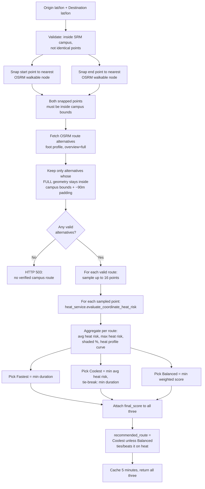

# Route Calculation and Optimization

This document is the authoritative, code-verified reference for how UrbanHeat generates and scores routes. It supersedes any generic route-optimization description — every step below is traced directly to `backend/app/services/route_service.py` and `backend/app/services/campus_config.py`.

**Important correction up front:** UrbanHeat does **not** implement a "shortest route + 20% maximum detour" model. There is no distance-ratio cap anywhere in the code. The actual constraint that filters out undesirable routes is a **campus-boundary geometry check**, not a detour percentage. This document describes the real algorithm.

---

## 1. High-Level Flow



Source: `RouteService._compute_route_recommendation()` in `backend/app/services/route_service.py:255-373`.

---

## 2. Step-by-Step Detail

### 2.1 Pre-validation (`app/api/routes.py`)

Before any routing call:

```python
if abs(start_lat - end_lat) < 1e-6 and abs(start_lon - end_lon) < 1e-6:
    raise HTTPException(400, "Start location and destination cannot be identical.")

if not is_within_srm_campus(start_lat, start_lon) or not is_within_srm_campus(end_lat, end_lon):
    raise HTTPException(400, "Cool Routes currently supports locations inside the SRM Kattankulathur campus area only.")
```

### 2.2 Snap-to-walkable-point

Raw pin coordinates (e.g., a POI centroid or a map click) rarely sit exactly on a mapped footpath. `RouteService.snap_to_walkable_point(lat, lon)`:

1. Builds a list of candidate search origins: the original point, plus 8 offset points (±0.00025° and ±0.0005° in each axis) — a small local search grid.
2. For each candidate, calls OSRM's `/nearest` endpoint (`number=3`) with up to 2 retry attempts.
3. Returns the **first successful** snapped `(lat, lon, distance_from_original_in_meters)`.
4. Raises `ValueError` if no mapped walking path is found near either pin at all.

Start and end are snapped **concurrently** using a `ThreadPoolExecutor(max_workers=2)` — a deliberate performance optimization (documented in-code) that cuts ~1.5–2s off every request versus sequential snapping.

Both snapped points are then re-checked against the campus boundary; if either snap lands outside, a `ValueError` is raised ("nearest mapped walking path is outside the SRM campus boundary").

### 2.3 Fetching route alternatives

```python
url = f"{OSRM_BASE_URL}/{start_lon},{start_lat};{end_lon},{end_lat}?overview=full&geometries=geojson&steps=true&alternatives=true"
```

`OSRM_BASE_URL = "https://routing.openstreetmap.de/routed-foot/route/v1/driving"`. The path segment `driving` is fixed by OSRM's URL convention regardless of profile; the actual profile is `routed-foot` (walking), configured on the server side of this public OSRM deployment. Up to 3 attempts with short backoff; returns `[]` on total failure (handled upstream as "no usable route geometry").

`alternatives=true` asks OSRM for more than one distinct road/path option, but a public OSRM instance frequently returns only **one** route for short, simple campus trips — this is normal and handled gracefully (see §4).

### 2.4 Campus-boundary filtering — the real "constraint"

Every returned alternative's **entire decoded coordinate list** is checked:

```python
campus_route_options = [
    option for option in route_options
    if route_geometry_is_within_srm_campus(option["coords"])
]
```

`route_geometry_is_within_srm_campus()` (in `campus_config.py`) requires **every single coordinate** in the route geometry to fall inside the campus bounding box (padded by ~90 m). This is what actually rejects a route in this system — not a distance ratio. If OSRM's shortest/only path detours even briefly onto a public road outside the drawn campus box, the entire alternative is discarded, and if that leaves zero valid alternatives, the endpoint returns:

> `503`: *"No mapped walking path stays within the SRM campus between these two points (the nearest route detours onto public roads outside campus). Try selecting locations that are closer together or connected by an internal campus path."*

This was directly reproduced during testing: the frontend's own default demo start/end pair intermittently fails this check depending on which OSRM alternative is returned on a given request.

### 2.5 Route sampling

```python
@staticmethod
def sample_points_along_route(coords, max_samples=16):
    if len(coords) <= max_samples:
        return coords
    indices = np.linspace(0, len(coords) - 1, max_samples, dtype=int)
    return [coords[idx] for idx in indices]
```

A route's raw OSRM geometry can contain dozens to hundreds of coordinate pairs. To keep the number of downstream heat-risk evaluations (each a DB query or model inference) bounded, at most **16 evenly-spaced points** (by index, not by distance) are sampled per route. This is a deliberate performance/cost trade-off, not a precision claim.

### 2.6 Heat evaluation per sampled point

For every sampled `(lat, lon)`, `heat_service.evaluate_coordinate_heat_risk(db, lat, lon)` is called (full detail in [DATA_AND_ENVIRONMENTAL_ANALYSIS.md](DATA_AND_ENVIRONMENTAL_ANALYSIS.md)):

1. Look for a seeded database point within 1.5 km — if found, use its stored `heat_risk`/`risk_level`/environmental values directly.
2. Otherwise, compute a spatial-interpolation estimate (distance from a fixed "urban core" anchor and a fixed "green belt" anchor) and run it through the trained ML model.

### 2.7 Per-route aggregation

For each candidate route, `analyze_route_heat()` computes:

- `average_heat_risk` — mean of the sampled points' heat-risk scores
- `maximum_heat_risk` — max of the sampled scores
- `heat_risk_level` — bucketed from the **average**: `Extreme` (>75), `High` (>50), `Moderate` (>25), else `Low`
- `shaded_area_percentage` — mean of sampled `shade_score` × 100
- `heat_profile` — a list of `{position: 0-100, score}` points for charting the heat curve along the route
- `turn_by_turn` — OSRM step maneuvers converted to `{instruction, distance}`

### 2.8 Selecting Fastest / Coolest / Balanced

```python
fastest_route  = min(analyzed_routes, key=lambda r: r["duration_minutes"])
coolest_route  = min(analyzed_routes, key=lambda r: (r["average_heat_risk"], r["duration_minutes"]))

max_dist = max(r["distance_km"] for r in analyzed_routes) or 1.0
max_dur  = max(r["duration_minutes"] for r in analyzed_routes) or 1.0

balanced_route = min(
    analyzed_routes,
    key=lambda r: (
        0.5 * r["average_heat_risk"] / 100.0
        + 0.25 * r["distance_km"] / max_dist
        + 0.25 * r["duration_minutes"] / max_dur
    )
)
```

This is the **real weighted formula** — not a generic "Distance 30% / Heat 25% / AQI 25% / Safety 20%" model (there is no distance-only weight, no AQI term, no safety term anywhere in this codebase). It is exactly:

> **Balanced Score = 0.50 × (avg heat risk / 100) + 0.25 × (distance / max distance among candidates) + 0.25 × (duration / max duration among candidates)**

Lower score wins. Both `distance` and `duration` are normalized against the **maximum among the current candidate set**, not against any fixed scale — so this score is only meaningful for comparing routes within a single request, not across requests.

Every returned route (all three) also carries this same `final_score`, rounded to 3 decimals, for display purposes — including the Fastest and Coolest routes, which are simply the route dict that happened to win a different selection criterion, re-labeled.

### 2.9 Recommendation

```python
recommended = "coolest_route" if coolest_route["average_heat_risk"] <= balanced_route["average_heat_risk"] else "balanced_route"
```

Since `coolest_route` is *defined* as the route with the minimum average heat risk among all candidates, this condition is true by construction in every normal case — `balanced_route` can only ever **tie**, not beat, `coolest_route` on heat risk. In practice, **`recommended_route` is effectively always `"coolest_route"`**, unless there is exactly one candidate route (in which case Fastest, Coolest, and Balanced are all the same route anyway, and the comparison is a no-op tie).

### 2.10 Missing-alternative handling

When OSRM only returns a single valid in-bounds route (common for short campus trips), `fastest_route`, `coolest_route`, and `balanced_route` are all the **same underlying route data**, independently deep-copied and re-labeled. The response still returns three distinct-looking cards to the frontend so the UI remains useful, but `comparison.alternatives_available` is explicitly set to `false` in this case so the frontend/user is not misled into thinking real alternatives were compared.

### 2.11 Caching

```python
_ROUTE_CACHE_TTL_SECONDS = 300
```

Results are cached **in-process** (a plain Python dict guarded by a `threading.Lock`), keyed by the 5-decimal-rounded `(start_lat, start_lon, end_lat, end_lon)` tuple, for 5 minutes. This is not a persistent cache (it resets on server restart) and is not shared across multiple backend worker processes if deployed with more than one.

---

## 3. What Is a "Viable Route" — Actual Implementation

> A viable route, as implemented, is a route returned by the OSRM foot-routing service between the snapped start and end points whose **entire decoded geometry** (every coordinate, not just endpoints) lies within the SRM KTR campus bounding box, padded by approximately 90 metres.

There is no separate "20% detour" viability check, no minimum/maximum distance check, and no geometry-shape validation beyond "has at least 2 coordinates" (checked once, in `extract_route_coordinates`, before boundary filtering).

---

## 4. Worked Example (Reproduced From Live Testing)

Using the app's own default demo coordinates (`RoutesPage.jsx`): start `(12.8232, 80.0450)`, end `(12.8246527, 80.0452877)`.

A direct backend call with these exact coordinates returned, on one test run:

| Route | Distance | Duration | Avg Heat Risk | Final Score |
|---|---:|---:|---:|---:|
| Coolest / Balanced / Fastest (all identical — only 1 OSRM alternative returned) | 0.19 km | 2.5 min | 50.3 | 0.752 |

`comparison.alternatives_available = false`, `mapped_route_count = 1`. This demonstrates the "single alternative" case from §2.10 — not a hypothetical, but the actual behavior observed for this pair of points at test time. On a separate live attempt with the identical inputs, the request instead failed with a `503` ("no mapped walking path stays within the SRM campus...") — because a **different** OSRM alternative was returned on that call and it failed the boundary check. This variability is a direct, observed consequence of depending on a public, non-deterministic third-party routing service, and is documented as a real limitation rather than a hypothetical one.

A genuinely multi-alternative example (start `12.820, 80.040` → end `12.825, 80.048`, ~1.8 km) returned 1 valid in-bounds alternative out of however many OSRM computed — again resulting in identical Fastest/Coolest/Balanced cards, because only one alternative survived the campus-boundary filter.

**Conclusion from live testing:** for this campus's road/path graph and a public, single-alternative-prone OSRM deployment, the Coolest/Balanced/Fastest distinction visibly manifests only when OSRM happens to return 2+ alternatives that all also happen to stay within the tight campus boundary — which was not reliably observed during testing. This is documented honestly rather than presented as a guaranteed three-way comparison.

---

## 5. Why UrbanHeat Does Not Always Select the Shortest Route

When multiple valid in-bounds alternatives *do* exist, `coolest_route` is chosen purely by minimum average heat risk, with **no regard to how much longer or further that route is** — there is no penalty term or cap that would ever reject a cooler-but-longer alternative for being "too much of a detour." This is a deliberate design choice verified in the code (§2.8): heat risk is the sole primary key for `coolest_route`, and it also dominates the `balanced_route` formula at a 50% weight versus 25%/25% for distance/duration. A user should understand this as "UrbanHeat prioritizes heat exposure over minimizing distance/time, by design, with no upper bound on the trade-off" — not as a 20%-style safety cap, since no such cap exists in this implementation.

---

## 6. `/api/route-heat` — Ad-hoc Geometry Analysis

A second, simpler endpoint (`POST /api/route-heat`) accepts an arbitrary list of `[lat, lon]` coordinates (e.g., a custom-drawn path) and runs the same `analyze_route_heat()` sampling/aggregation pipeline on it directly — no OSRM call, no route alternatives, no scoring/comparison. It requires at least 2 coordinates and that all of them fall within the campus boundary.

---

*Cross-reference: [API_DOCUMENTATION.md](API_DOCUMENTATION.md) for the exact request/response schema of `/api/recommend-route` and `/api/route-heat`; [DATA_AND_ENVIRONMENTAL_ANALYSIS.md](DATA_AND_ENVIRONMENTAL_ANALYSIS.md) for how a single point's heat risk is computed.*
